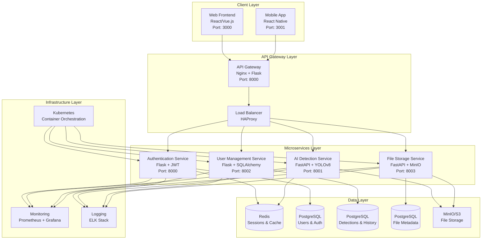
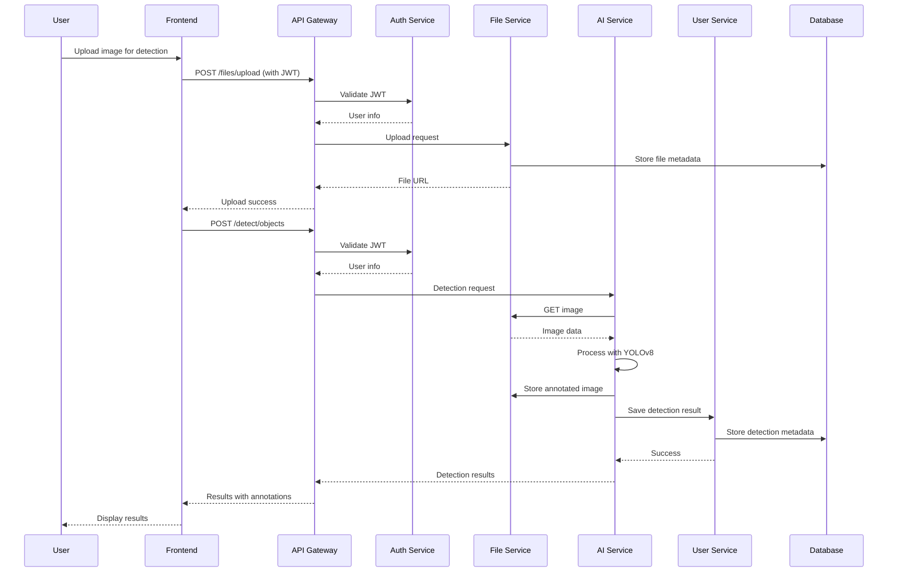
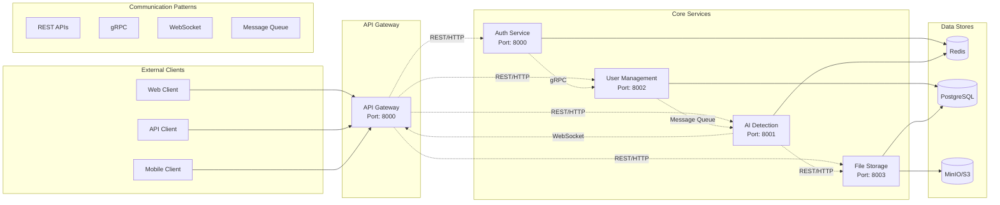
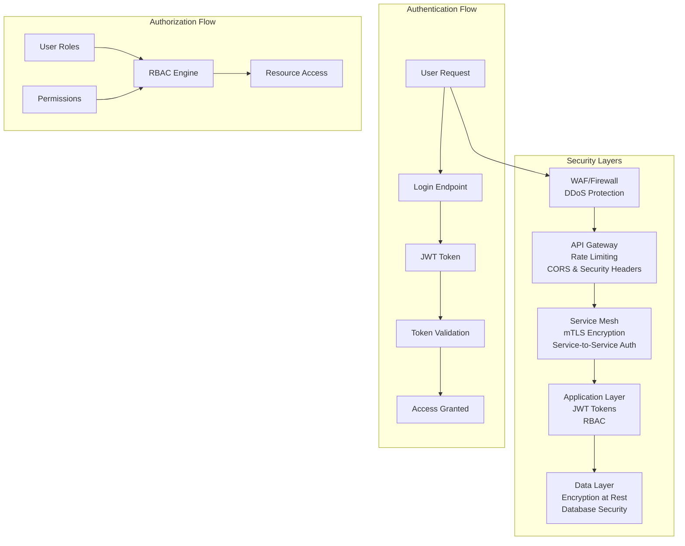
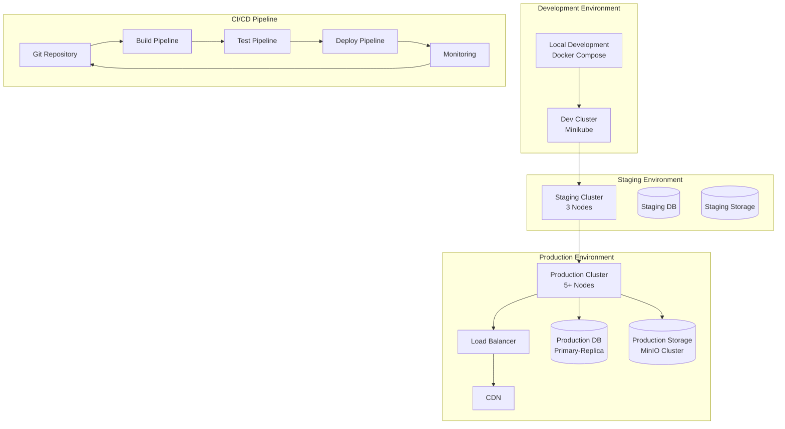
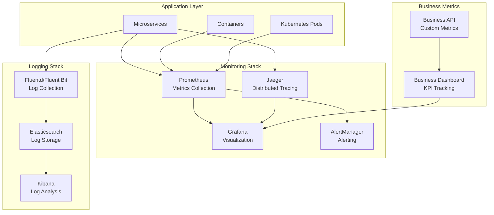
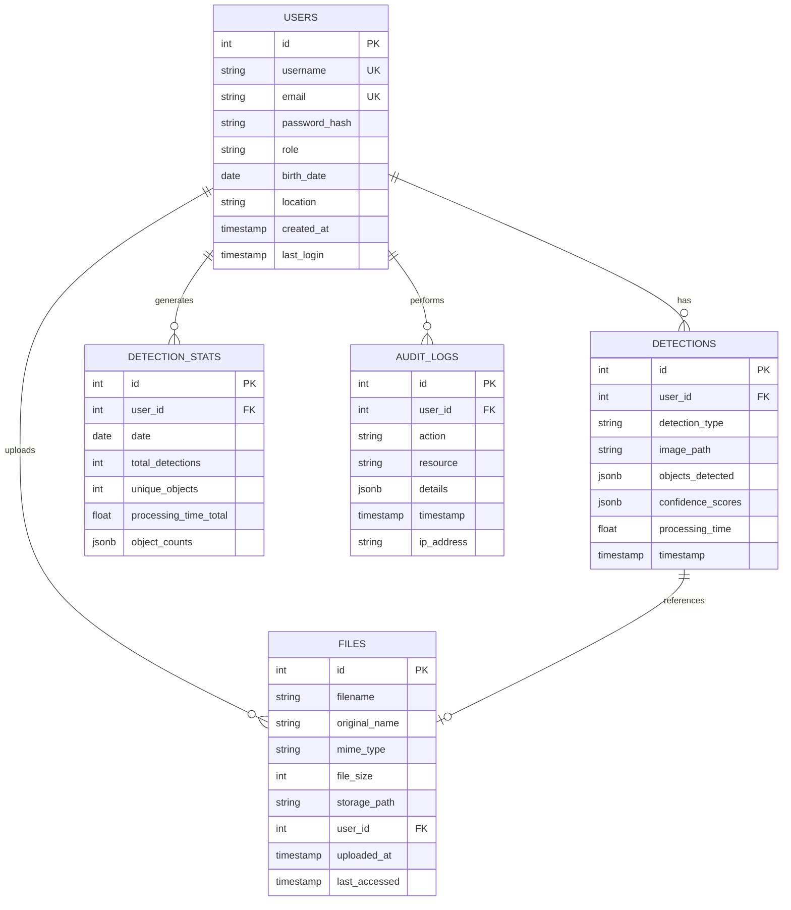
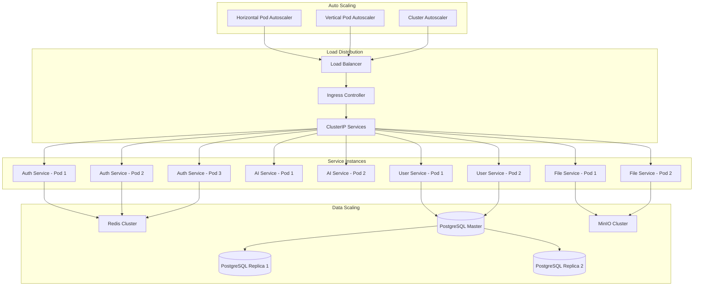
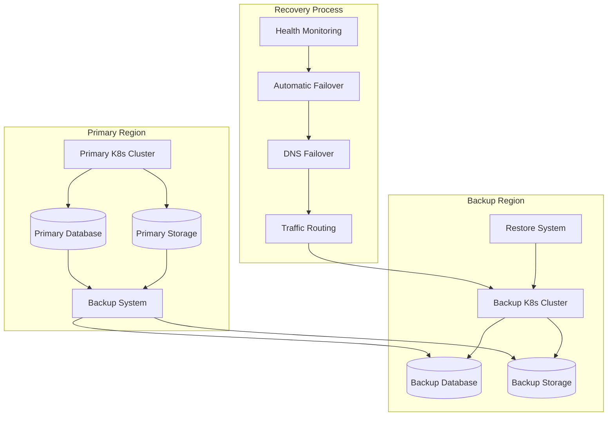
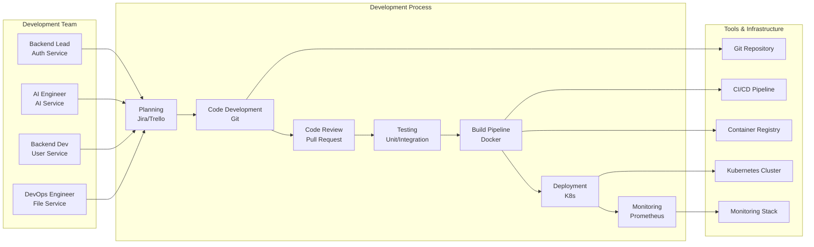

# VisionAI Architecture Diagrams

## 1. Sơ đồ kiến trúc tổng thể (Overall Architecture)

## 2. Sơ đồ luồng dữ liệu (Data Flow Diagram)

## 3. Sơ đồ Microservices Communication

## 4. Sơ đồ Security Architecture

## 5. Sơ đồ Deployment Architecture

## 6. Sơ đồ Monitoring & Observability

## 7. Sơ đồ Database Architecture

## 8. Sơ đồ Scaling Strategy

## 9. Sơ đồ Disaster Recovery

## 10. Sơ đồ Development Workflow

